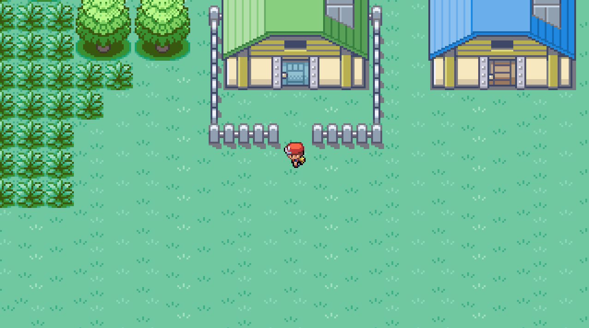
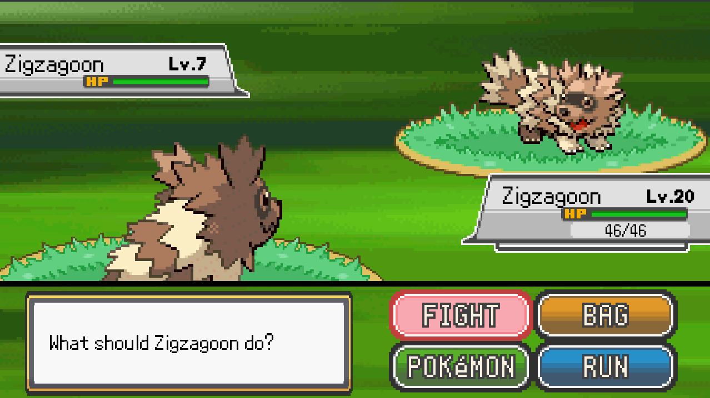
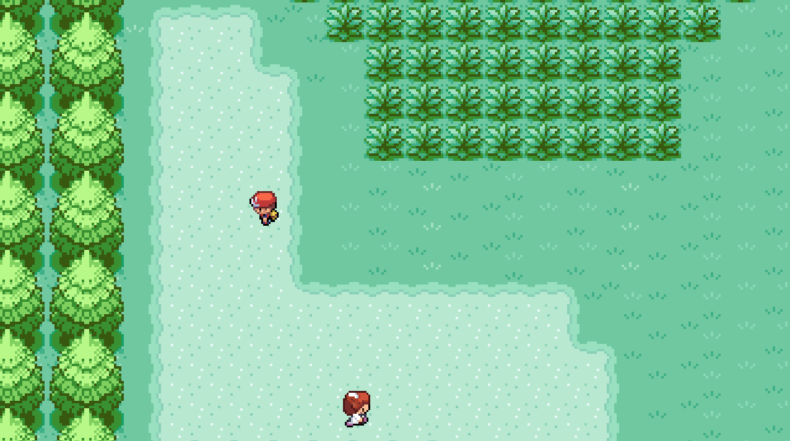

# PokéSharp

> This project is a **non-commercial, educational clone** of the original Pokémon games, developed purely to demonstrate how such a game can be implemented from scratch using C#. pls Nintendo don't sue me.

If you'd like to be kept informed of the project's progress, please feel free to join the newly-created discord: https://discord.gg/8zhqU4EjG2

## Purpose

This project wasn't originally intended for the public and its main aim was to teach me how to develop and finish a project from start to finish, as I often tend not to finish what I start. I set myself the rather crazy challenge of recreating a clone of the Pokémon game in 48 hours of pure work, and I think I can consider that I succeeded in this challenge.   

Today I've decided to publish the repository in order to share with you a project I'm quite proud of and to allow the community to potentially learn from it. But as you can imagine, we can't reach the moon in 48 hours of work, which is why there's still a lot of work to do.

---

## Little disclaimer

This project:
- Is **strictly for educational use**
- **Is not for sale or monetized** in any way
- Will **never be used in a commercial context**

It is **not affiliated with Nintendo, Game Freak, or The Pokémon Company**, and is not intended for commercial distribution or public gameplay.  

None of the game's assets are hosted on the repository in order to avoid any copyright problems. This will prevent you from building & running the project on your local machine. See the Getting Started section for further informations

If you are a rights holder and have any concerns, please [open an issue](https://github.com/) or contact me directly.  

---

## What will PokeSharp become in the future?

PokeSharp's ambition is to become an open-source educational resource for learning how to create a Pokémon-like game engine from scratch, in C# with Monogame. 

Whether you've never contributed to an open-source project before or are already experienced in the field, PokeSharp has been designed as a collaborative project in which everyone can participate.

## Screenshots

### Gameplay

### Wild Battle

### NPC Dialogue

---

## Game Features

- **Player Movement**: Classic top-down 2D grid-based movement.
- **NPCs**:
  - Patrol behavior
  - Dialogue interaction system
- **Creatures**:
  - Battle system with health, damage, and stats
  - Element types (Fire, Water, Dragon, etc.) similar to the original games
  - Movement and turn-based attacks
- **Wild Battles**:
  - Triggered when walking on tall grasses

---

## Engine Features

- **Coroutine System**: Custom lightweight coroutine implementation for asynchronous flow.
- **Tweening System**: Smooth movement/animation handling via coroutine-driven tweening.
- **Screen Manager**: Handles transitions and screen stack management.
- **Tiled Integration**:
  - Loads maps and entities using the [Tiled Map Editor](https://www.mapeditor.org/)
- **Animation System**: Frame-based sprite animations with custom animation controller.

---

## Contributions
Although the aim of this project is to become collaborative, much of the architecture needs to be rethought slightly in order to have a solid structure for the future.

That's why I prefer to avoid any kind of contribution at the moment, in the meantime you can still study the structure of the project to familiarise yourself with it.

---

## Getting Started
Due to copyright issues, it is not currently possible for you to build & run the project. However, I am actively working on a solution that will load the game's assets at runtime via a ROM. The idea behind this is to avoid any direct link between the Pokémon assets and my project in order to guarantee its durability. Thanks to this, anyone wanting to work on the project will be able to build and run without needing to own assets protected by Pokémon.

---

## License

This project is not licensed for redistribution or commercial use. It is shared solely for educational demonstration under fair use assumptions.
